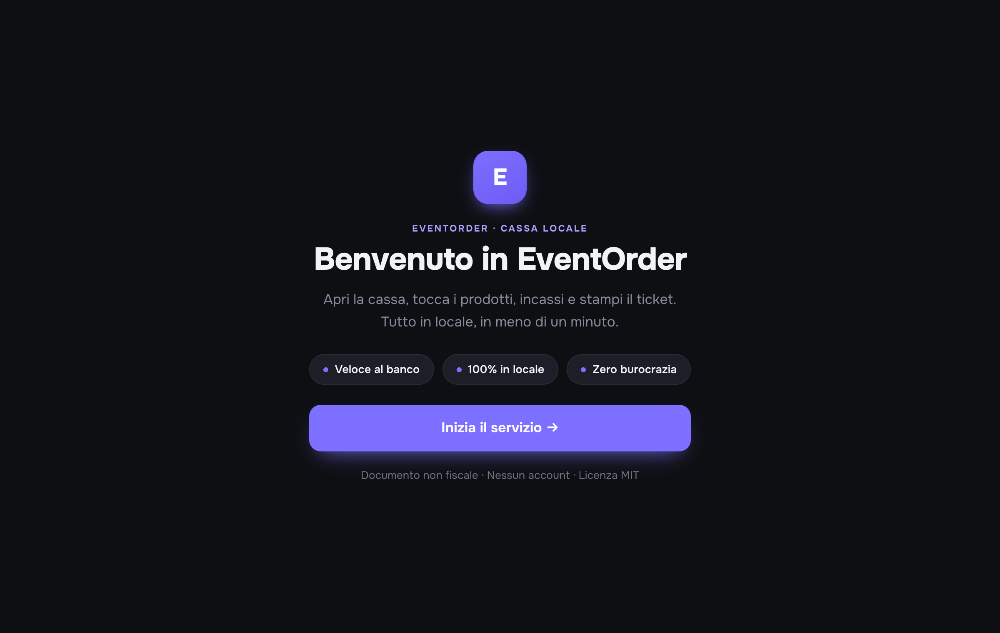
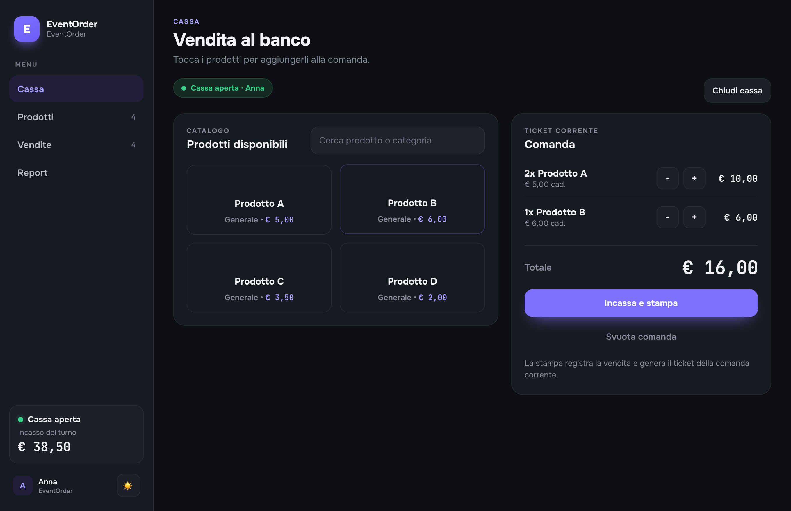
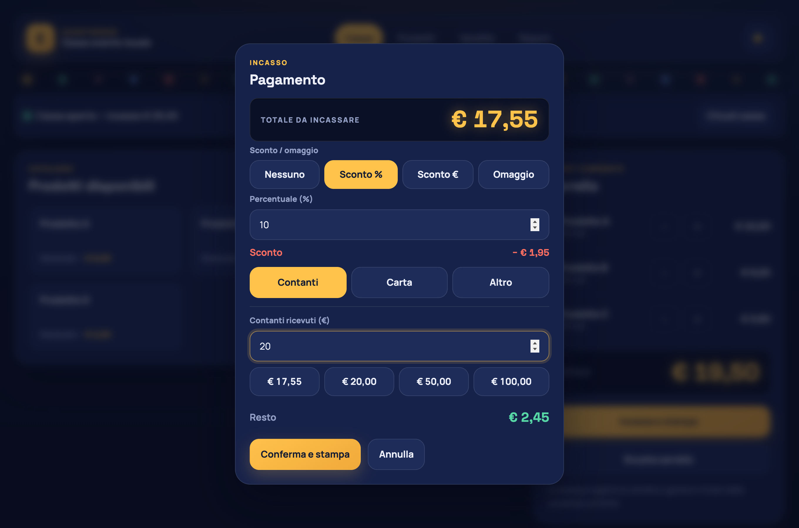
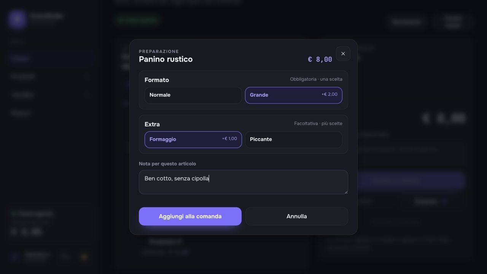
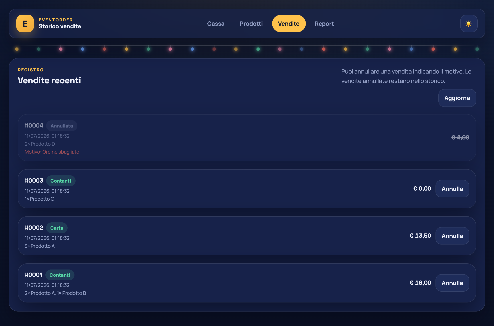
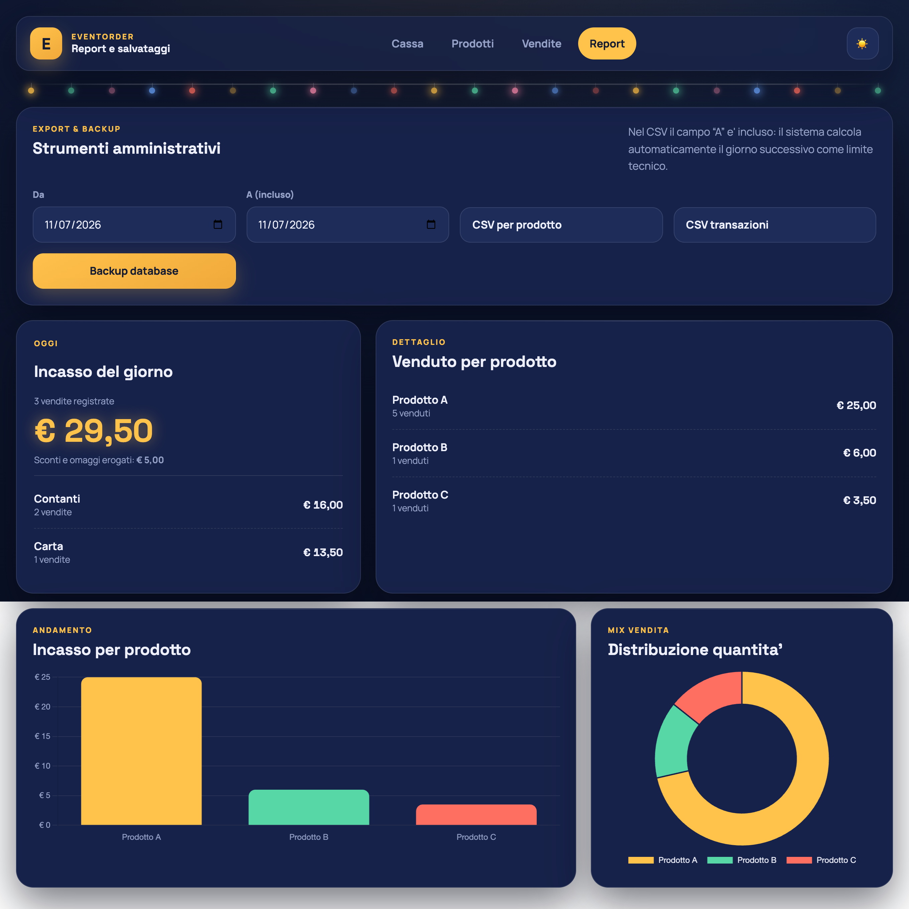
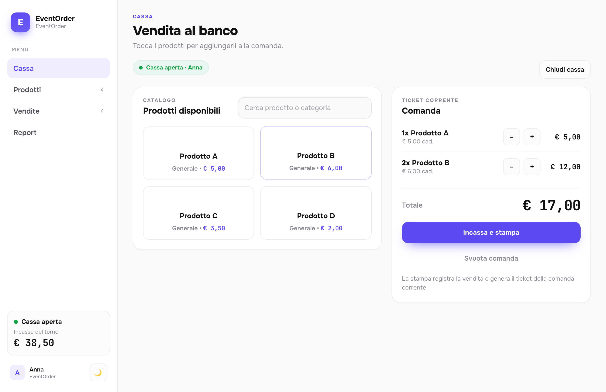
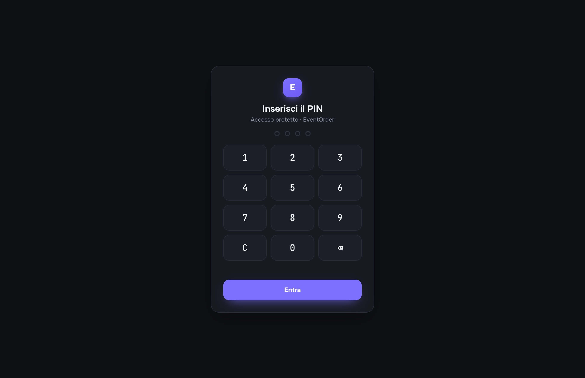

<div align="center">

# 🎟️ EventOrder

### Il registratore di cassa per le tue feste.

**Veloce al banco. Tutto in locale. Zero burocrazia.**

Pensato per sagre, mercatini, banchetti, feste di paese e Pro Loco:
apri la cassa, tocca i prodotti, incassi e stampi il ticket. Fine.


<br>



</div>

<br>

## Perché EventOrder

Alle feste non serve un gestionale: serve **battere una comanda in due secondi**,
sapere quanto c'è in cassa a fine serata e non perdere un incasso. EventOrder fa
esattamente questo, girando in locale sul tuo computer o tablet — **nessun account,
nessun canone, nessun dato che esce dalla macchina**.

- ⚡ **Veloce** — catalogo a griglia, un tap per aggiungere, totale sempre in vista.
- 💶 **Pensato per i contanti** — calcolo del resto, tasti rapidi (€20, €50, €100…).
- 🌙 **Chiaro e scuro** — interfaccia curata con tema scuro di default e tema chiaro per il giorno.
- 🔌 **Autonomo** — un file database locale, backup e ripristino guidato.

<br>

## Cosa puoi fare

### 🛒 La cassa, in due tap

Tocca i prodotti dal catalogo, la **comanda** si compone a lato con il totale
sempre in vista. Layout pensato per il banco: bottoni grandi, numeri leggibili
in monospazio, tema scuro o chiaro.

<div align="center">

</div>

### 💶 Incassi in un lampo — con resto, sconti e omaggi

Scegli **contanti, carta o altro**. Per i contanti inserisci quanto ti danno e il
**resto è calcolato al volo**. Applichi al volo uno **sconto in percentuale o in
euro**, oppure segni un **omaggio** ("offerto della casa").

<div align="center">

</div>

### 🧾 Turni di cassa e chiusura

Apri il turno con il **fondo cassa** iniziale, vendi, e a fine serata **chiudi la
cassa**: EventOrder ti dice quanti contanti dovrebbero esserci, tu li conti e vedi
subito l'eventuale **scostamento**. Come un vero registratore (ma non fiscale).

A turno aperto registri anche i **movimenti di cassa** — prelievi di sicurezza o
aggiunta di monete per il resto — con importo e motivo: entrano nel calcolo dei
contanti attesi, così la quadratura torna anche quando la cassa non resta intatta.

### 🚫 "Esaurito" al volo e scorte

Il ragù è finito a metà serata? **Tieni premuta la card** del prodotto in cassa
e segnalo **esaurito**: resta visibile ma non vendibile, un tocco lo rimette in
vendita. Se vuoi, imposta le **scorte** dalla pagina Prodotti: si scalano a ogni
vendita (gli storni le ripristinano), la card mostra i pezzi rimasti e a zero il
prodotto si blocca da solo.

### 🧩 Varianti, modificatori e note

Un prodotto può avere gruppi di scelta singola o multipla, obbligatori oppure
facoltativi: formato, cottura, gusti ed extra con variazioni di prezzo. La cassa
mantiene il prodotto semplice a un solo tocco; apre la scheda di preparazione
soltanto quando servono scelte. Puoi aggiungere una nota al singolo articolo e
una nota generale alla comanda. Tutto viene conservato nello storico, nel ticket,
negli export e nelle comande sospese anche se il catalogo cambia in seguito.

<div align="center">

</div>

### 📜 Storico vendite e storni

Ogni vendita finisce nel registro. Hai sbagliato una comanda? **Annullala** con un
motivo finché il turno è aperto: resta nello storico ma esce dai conti. Dopo la
chiusura il turno è immutabile, così quadratura e storico restano coerenti.

<div align="center">

</div>

### 📊 Numeri chiari, per giorno o per turno

Incassi, **suddivisione per prodotto e per metodo di pagamento**, sconti e
omaggi, con grafici a colpo d'occhio. Filtri il report **per intervallo di date
o per singolo turno**, confronti le **giornate di una sagra multi-giorno** e
consulti le **chiusure di cassa** con ammanchi, eccedenze e note. Se imposti il
**costo** dei prodotti vedi anche il **margine** (fotografato alla vendita), e
gli **sconti sono ripartiti sui prodotti** al centesimo. Esporti tutto in
**CSV** — aggregato, per transazione o **riga per articolo** — e fai il
**backup del database**. Dalla stessa pagina puoi ripristinarlo in sicurezza:
EventOrder verifica file e schema, richiede la cassa chiusa e crea prima una
copia automatica dei dati correnti. Lo storico vendite si filtra per numero, data,
prodotto, operatore, metodo e stato.

<div align="center">

</div>

### 🌗 Giorno e notte

Interfaccia **touch-first** (bottoni grandi, numeri in monospazio, niente fronzoli)
con **tema scuro e chiaro**: lo scuro riposa la vista di sera, il chiaro è perfetto
di giorno. Cambia con un tocco, la scelta viene ricordata.

<div align="center">

</div>

<br>

## Provalo in 1 minuto

```bash
npm install
cp .env.example .env      # opzionale: personalizza nome, valuta, operatori
npm run dev
```

Apri **http://localhost:3000**: parti dalla schermata di benvenuto, premi
**Inizia il servizio** e sei in cassa. Al primo avvio trovi qualche prodotto demo
(disattivabile): entra nella pagina **Prodotti** e crea i tuoi.

> Serve **Node.js 24 LTS** (vedi `.nvmrc`). Con `nvm`: `nvm use`.

<br>

## Lo fai tuo in un attimo

Nome, valuta, operatori e accesso si impostano da `.env` — **stesso software,
qualsiasi evento**, senza toccare il codice.

```env
APP_NAME=Sagra del Paese
BUSINESS_NAME=Pro Loco 2026
CURRENCY_SYMBOL=€
CURRENCY_CODE=EUR
OPERATORS=Anna,Luca,Marco
# APP_PIN=1234        # opzionale: PIN numerico di massimo 8 cifre
```

| Variabile | Cosa fa |
|---|---|
| `APP_NAME` / `BUSINESS_NAME` | Nome nell'app / nome stampato sul ticket |
| `CURRENCY_SYMBOL` / `CURRENCY_CODE` / `LOCALE` | Valuta e formato di date e numeri |
| `OPERATORS` | Operatori selezionabili all'apertura del turno |
| `APP_PIN` | PIN d'accesso (vuoto = nessuna protezione) |
| `HOST` | Interfaccia di rete (`127.0.0.1` di default; `0.0.0.0` per la LAN) |
| `ALLOWED_HOSTS` | Hostname/IP accettati dal server, obbligatori in LAN |
| `PUBLIC_ORIGIN` | Origin completo del browser, obbligatorio in LAN |
| `TRUST_PROXY` | `loopback` solo per un reverse proxy sulla stessa macchina |
| `POS_SEED_DEMO` | Prodotti demo al primo avvio (`0` per disattivare) |
| `BACKUP_KEEP` | Quanti backup manuali/pre-restore conservare (`0` = illimitati) |
| `PRE_MIGRATION_BACKUP_KEEP` | Quanti backup pre-migrazione conservare separatamente |
| `AUDIT_RETENTION_DAYS` | Giorni di audit operativo da conservare (`0` = illimitato) |
| `OPERATION_REQUEST_RETENTION_DAYS` | Giorni di replay idempotenti dei turni chiusi (`0` = illimitati) |
| `PORT` | Porta HTTP (`3000` di default) |
| `LOG_REQUESTS` | Log JSON delle richieste (`1` per attivarli) |

Con `APP_PIN` impostato, l'accesso è protetto da un **PIN-pad** touch:

<div align="center">

</div>

> **Accesso da tablet in LAN:** imposta `HOST=0.0.0.0` e configura sempre
> `APP_PIN`, `ALLOWED_HOSTS` e `PUBLIC_ORIGIN`; senza questi valori il server
> rifiuta l'avvio. Se HTTPS termina su nginx/Caddy nella stessa macchina,
> imposta anche `TRUST_PROXY=loopback`: il cookie diventa `Secure` e il rate
> limiting usa l'IP client inoltrato dal proxy attendibile.

<br>

## Le pagine

| | |
|---|---|
| **Benvenuto** (`/`) | Schermata iniziale, si entra col pulsante "Inizia il servizio" |
| **Cassa** (`/cassa.html`) | Vendita: catalogo, comanda, incasso |
| **Prodotti** | Catalogo con riordino drag-and-drop o pulsanti da tastiera |
| **Vendite** | Storico e storni |
| **Report** | Numeri del giorno, export CSV, backup |

<br>

<details>
<summary><b>Sotto il cofano</b> (per chi sviluppa)</summary>

<br>

- **Node.js 24 LTS + Express 5**, **SQLite** (`better-sqlite3`), frontend **vanilla JS** (nessun build step).
- Importi gestiti in **centesimi interi** (niente errori di arrotondamento).
- Ogni incasso inviato dall'interfaccia usa una chiave idempotente: un retry di
  rete restituisce la vendita gia' registrata senza duplicarla o scalare di nuovo le scorte.
- Nome e categoria dei prodotti salvati nella vendita: le rinomine future non alterano lo storico.
- Varianti, modificatori, prezzi finali e note sono salvati come snapshot immutabili nella vendita.
- Report e chiusura usano l'**ora locale** per attribuire correttamente le vendite a cavallo della mezzanotte.
- Backup con copia **online consistente** di SQLite, rotazione automatica e
  ripristino verificato con backup di sicurezza preventivo.
- Branding/valuta esposti al frontend via `GET /api/config`.
- Suite di test con `node:test` su database e flussi applicativi.

```bash
npm run dev    # sviluppo con reload
npm start      # avvio
npm run lint   # analisi statica JavaScript
npm test       # lint + suite completa
npm run coverage # copertura backend con soglie minime
npm run test:e2e # flussi critici in Chromium
npm run test:scale # scenari ad alto volume
npm run test:fault # crash e recovery
```

**Stampa ticket**: attualmente il ticket viene scritto su console (stub); l'integrazione
ESC/POS (USB/LAN) è il prossimo passo.

</details>

<br>

<div align="center">
<sub>EventOrder — cassa locale non fiscale · Licenza MIT</sub>
</div>
